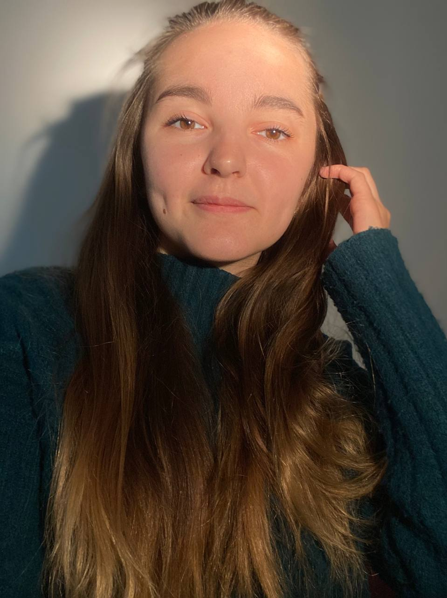

# Доброго времени суток!
### Меня зовут _Хмель Елизавета Владимировна_, приятно с вами познакомиться.

### О себе:
По окончанию 11-ти классов школы, я пошла работать. Работаю 4 года адмиинистратором медицинского центра. За это время я приняла окончаельно решение, что мне интересно направление IT и остановилась на профессии-тестировщик.

Из своих качеств могу выделить сильные стороны: 
1. Коммуникабельность
2. Отзывчивость
3. Ответственность 
4. Перфекционизм
   
Что касается слабых сторон, то из них могу выделить периодическую невнимательность, но если знать о своих слабых сторонах, то, я считаю, контролировать их гораздо проще :)

При столкновении со сложностями, будь то в жизни, будь то в работе или изучении чего то нового, я постоянно вспоминаю цитату: 
> ### __Per aspera ad astra__ 
> 
> -_Изречение, означающее «Через усилие к победе», «Через трудности к триумфу», «Через тернии к звездам». Его авторство приписывается Луцию Аннею Сенеке, древнеримскому философу, поэту и государственному деятелю_.

